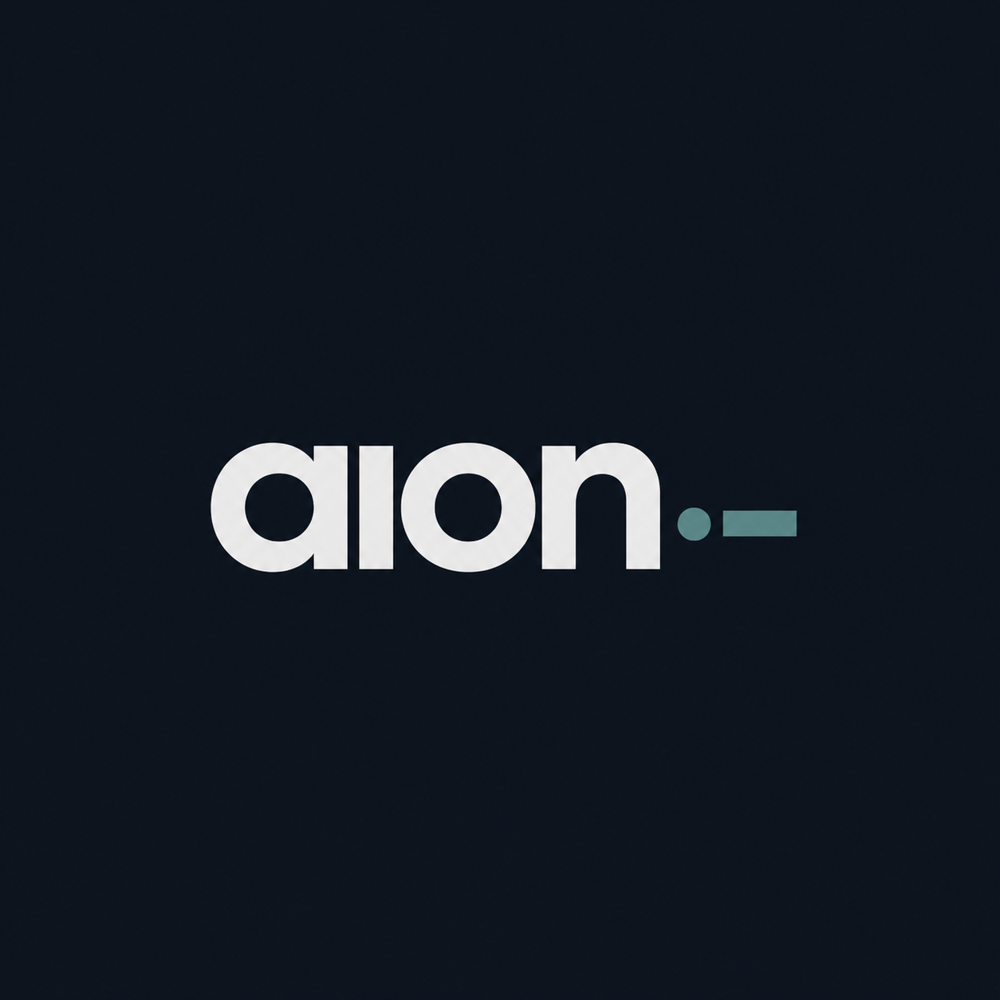

<p align="center">
  <a href="https://aion-context.dev">
    
  </a>
</p>

# aion-context

> **A verifiable control layer for AI agents. Keep critical policies
> outside the model, prove who approved every change, and give auditors
> a trail they can trust.**

[](https://crates.io/crates/aion-context)
[](https://docs.rs/aion-context)
[](#license)

**Live demo:** [demo.aion-context.dev](https://demo.aion-context.dev/) — running `.aion` policies in a real agent loop.

## Why teams use it

AI agents are starting to touch workflows where "just put it in the
prompt" is not enough: access rules, refund limits, escalation
thresholds, clinical or financial policies, jurisdiction constraints,
and customer-specific exceptions. Those rules need to be updated
without retraining a model, enforced outside the model, and explained
months later when someone asks what the system was allowed to do.

`aion-context` turns business rules into signed policy artifacts.
Your agent can check the policy before it acts. Your operators can
update policy through signed versions. Your security, compliance, or
audit team can verify what changed, who approved it, and whether the
file was altered after the fact.

Use it when you need to answer:

- What did the approved policy say when this agent acted?
- Who approved the latest policy change?
- Has this policy file been edited outside the approved path?
- Can we change agent behavior without changing the model or prompt?
- Can an auditor independently verify the policy history?

## What it does

At the product level, aion-context gives you:

| Need | What aion-context provides |
|---|---|
| **Rules outside the model** | Keep enforceable policy in a file the model can read but not silently rewrite. |
| **Signed policy changes** | Every policy version is signed by an authorized key, so ownership and approval are explicit. |
| **Tamper evidence** | If someone flips a byte, deletes history, or rewrites a prior version, verification fails. |
| **Audit-ready history** | The policy carries its own version trail, so teams can reconstruct what changed over time. |
| **Local enforcement** | The CLI and Rust library work offline; no hosted service is required. |

Under the hood, `.aion` files wrap YAML, Markdown, JSON, or any other
policy payload in a versioned signature chain with integrity checks.
The technical details matter, but the outcome is simple: policy changes
become provable instead of assumed.

It is *not* a replacement for sigstore, in-toto, or SLSA. It is the
policy/document-shaped sibling those systems leave on the table — see
[the comparison chapter] for the contrast.

[the comparison chapter]: book/src/comparison.md

## Hello world

```rust
use aion_context::crypto::SigningKey;
use aion_context::key_registry::KeyRegistry;
use aion_context::operations::{init_file, verify_file, InitOptions};
use aion_context::types::AuthorId;
use std::path::Path;

fn main() -> anyhow::Result<()> {
    let key = SigningKey::generate();
    let author = AuthorId::new(1);
    let mut registry = KeyRegistry::new();
    registry.register_author(author, key.verifying_key(), key.verifying_key(), 0)?;

    init_file(
        Path::new("/tmp/policy.aion"),
        b"allow: read\nallow: write",
        &InitOptions { author_id: author, signing_key: &key, message: "v1", timestamp: None },
    )?;

    let report = verify_file(Path::new("/tmp/policy.aion"), &registry)?;
    assert!(report.is_valid);
    Ok(())
}
```

That's a signed, tamper-evident policy file in twelve lines. Flip
one byte of the file and `report.is_valid` is `false` — no further
configuration needed.

## Install

```bash
# CLI:
cargo install aion-context

# Library:
cargo add aion-context
```

Or from source:

```bash
git clone https://github.com/aion-context/aion-context
cd aion-context
cargo install --path . --bin aion
aion --help
```

## What's in the box

| Layer | What you get |
|---|---|
| **CLI** (`aion`) | `init` / `commit` / `verify` / `inspect` / `registry rotate \| revoke` / `release seal \| verify` / `archive verify` / `key generate` |
| **Library** | `init_file` / `commit_version` / `verify_file` / `KeyRegistry` / `verify_multisig` (RFC-0021) / sealed releases (RFC-0032) / hardware attestation (RFC-0026) / hybrid PQC (RFC-0027) / transparency log (RFC-0025) |
| **Format** | Zero-copy binary layout. One header, one chained signature history, one encrypted_rules section, one trailing integrity hash. The latest payload is always inline; historical payloads are addressed by their `rules_hash` for external archival. |
| **Tracing** | `AION_LOG=info` produces structured per-event lines (`event=file_verified`, `event=signature_rejected reason=...`, etc.). `AION_LOG_FORMAT=json` for log-store ingest. |
| **Examples** | `policy_loop`, `llm_policy_agent` (Claude as proposer + `.aion` as gate), `aegis_consortium` (5-party PQC quorum), `federation_hw_attest` (cross-domain TEE keys), `corpus_to_aion` (any git history → signed chain) |

## Standards and protocols

aion-context speaks the existing supply-chain ecosystem rather
than replacing it. Sealed releases (RFC-0032) emit DSSE-wrapped
SLSA Statements you can hand to sigstore-shaped verifiers; the
transparency log (RFC-0025) is RFC 6962-compatible; OCI manifests
let releases publish through container registries; JCS gives
deterministic JSON for cross-implementation hashing.

[](https://www.rust-lang.org/)
[](https://crates.io/crates/aion-context)
[](https://www.sigstore.dev/)
[](https://slsa.dev/)
[](https://in-toto.io/)
[](https://opencontainers.org/)
[](https://github.com/secure-systems-lab/dsse)
[](https://datatracker.ietf.org/doc/rfc8785/)
[](https://datatracker.ietf.org/doc/rfc6962/)
[](https://csrc.nist.gov/pubs/fips/204/final)
[](https://ed25519.cr.yp.to/)
[](https://github.com/BLAKE3-team/BLAKE3)
[](https://datatracker.ietf.org/doc/rfc8439/)

See the [comparison chapter] for how aion-context relates to each
of the neighbors above (when to reach for each).

[comparison chapter]: book/src/comparison.md

## Documentation

- **[The Book](book/src/SUMMARY.md)** — quickstart, mental model,
  CLI reference, architecture deep-dives, operations playbooks,
  examples narratives. Build with `mdbook serve book/`.
- **[Product Positioning](docs/POSITIONING.md)** — plain-English
  messaging for product, security, compliance, and platform audiences.
- **[CHANGELOG](CHANGELOG.md)** — what's in the version you're
  running.
- **[RFCs](rfcs/)** — 35 RFCs covering the protocol design from
  threat model through sealed releases.
- **[CONTRIBUTING](CONTRIBUTING.md)** — branch / commit / PR
  conventions.
- **[SECURITY](SECURITY.md)** — disclosure policy.

## Reference implementations

Production-shaped examples that show aion-context wired into a real domain, end to end:

- **[aion-edu](https://github.com/aion-context/aion-edu)** — a synthetic, AI-native
  university where every rubric, credential, and accreditation is a signed, hash-chained
  record. Demonstrates sealing and **offline verification**, **K-of-N multisig** for joint
  degrees, **registry-epoch** delegation/revocation, and institution-to-institution
  **federation** — a 7-crate Rust workspace with an axum web app (cinematic landing, live
  classroom, federation console).

## Status

**1.0.0** — public API, on-disk binary format, CLI exit-code
contract, structured tracing event vocabulary, and bounded
`reason` codes are now under semver. The full written stability
promise lives at [`book/src/architecture/stability.md`].

The crypto primitives (Ed25519, BLAKE3, ChaCha20-Poly1305,
HKDF-SHA-256, ML-DSA-65) will not change without a major version
and an RFC. Breaking changes carry `!` in the commit subject and
are documented in [CHANGELOG.md].

[`book/src/architecture/stability.md`]: book/src/architecture/stability.md
[CHANGELOG.md]: CHANGELOG.md

## Below the fold — for current contributors

### Build

```bash
cargo build --release
cargo test
cargo clippy --all-targets -- -D warnings
cargo fmt --check
cargo bench                                  # criterion benches
cargo audit && cargo deny check              # supply chain
```

### Project layout

```
src/                    library — the public crate
  audit.rs              append-only hash-chained audit log
  crypto.rs             Ed25519 + BLAKE3 + ChaCha20-Poly1305 primitives
  key_registry.rs       RFC-0028 trusted-key registry, rotations, revocations
  manifest.rs           RFC-0022 external-artifact manifests
  multisig.rs           RFC-0021 K-of-N quorum
  operations.rs         init / commit / verify public API
  parser.rs             zero-copy binary decoder
  release.rs            RFC-0032 sealed release composer
  serializer.rs         deterministic binary encoder
  signature_chain.rs    per-version signing & verification
  transparency_log.rs   RFC-0025 Merkle log + STH
  types.rs              FileId, AuthorId, VersionNumber newtypes
  bin/aion.rs           CLI binary
benches/                criterion perf benches
fuzz/                   cargo-fuzz targets (parser totality)
examples/               runnable demos + per-industry rules YAMLs
rfcs/                   the protocol specification
book/                   mdbook source for the operator manual
.claude/                rules + agents + hooks for agentic contributors
```

### Core principles

1. **Tiger Style** — zero `unwrap()` / `expect()` / `panic!` /
   `todo!` / `unreachable!` in library code. Every fallible
   function returns `Result<T, AionError>`. `unsafe_code` is
   forbidden. The crate-level clippy lints enforce this at compile
   time.
2. **Crypto is sacred** — load-bearing primitives come from
   `ed25519-dalek`, `blake3`, `chacha20poly1305`. Never hand-rolled.
3. **Zero-copy where it matters** — the parser uses `zerocopy` to
   avoid allocation on the hot path.
4. **RFC-first** — non-trivial format / crypto / protocol changes
   need an RFC under `rfcs/` before code lands.
5. **Offline-first** — the library never touches the network. The
   `aion` CLI is a single static binary.

## License

Dual-licensed under [MIT](LICENSE-MIT) **OR** [Apache-2.0](LICENSE-APACHE),
at your option.

## Community

- Bug reports → [GitHub Issues](https://github.com/aion-context/aion-context/issues/new/choose)
- Security reports → see [SECURITY.md](SECURITY.md) (private flow only)
- Open-ended questions / design discussions → [Discussions](https://github.com/aion-context/aion-context/discussions)
- Contribution rules → [CONTRIBUTING.md](CONTRIBUTING.md), [CODE_OF_CONDUCT.md](CODE_OF_CONDUCT.md)
